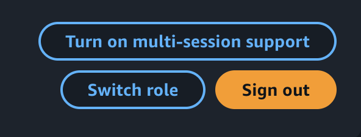

# Multi-Session Support

- Multi-session support enables AWS user to access multiple AWS accounts simultaneously in the AWS Console.
- AWS users can sign-in to up to 5 sessions in a single browser, and this can be any combination of root, IAM, or federated roles in different accounts or in the same account.
- Muli-session Support can be enabled in the account menu
  
